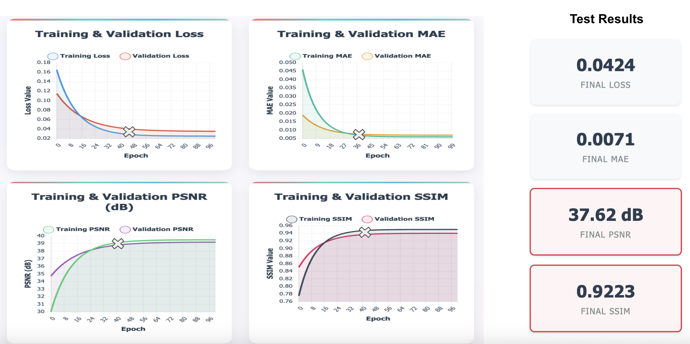
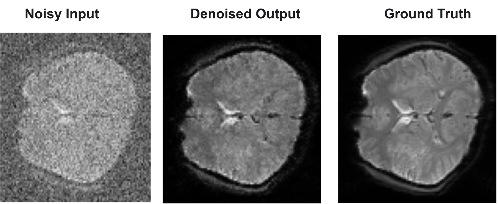

# Deep Learning for fMRI Denoising: A Comparative Analysis of 3D U-Net Attention and Wasserstein GAN Architectures for fMRI Denoising

This repository contains the official implementation for the Master's project "Deep Learning Based fMRI Denoising", comparing 3D U-Net Attention and 3DWGAN architectures. This study systematically develops and refines these models to enhance the signal-to-noise ratio (SNR) in functional Magnetic Resonance Imaging (fMRI) data.

---

## 📖 Table of Contents
- [Project Overview](#-project-overview)
- [Methodology and Architectures](#-methodology-and-architectures)
  - [Common Data Pipeline](#common-data-pipeline)
  - [Architecture 1: 3D U-Net with Attention (Iterative Development)](#architecture-1-3d-u-net-with-attention-iterative-development)
  - [Architecture 2: 3D Wasserstein GAN](#architecture-2-3d-wasserstein-gan)
- [Results Summary & Comparison](#-results-summary--comparison)
- [Qualitative Results](#-qualitative-results)
- [Repository Structure](#-repository-structure)
- [Setup and Usage](#-setup-and-usage)
- [Citation](#-citation)
- [License](#-license)

---

## 📝 Project Overview
Functional MRI (fMRI) data is inherently corrupted by significant noise, which compromises signal quality and limits neurobiological interpretations. This project tackles this challenge by implementing and comparing two state-of-the-art deep learning paradigms. The goal is to develop a robust model that can significantly reduce noise while preserving the fine-grained anatomical and structural details essential for accurate neuroscience research.

---

## 🛠️ Methodology and Architectures

### Common Data Pipeline
All experiments utilized the `ds002306` dataset from OpenNeuro. A custom `tf.keras.utils.Sequence` data generator was implemented to perform on-the-fly preprocessing. Foundational steps for all models included:
- **Resampling:** Volumetric data was resized to a uniform shape of `(64, 64, 48)`.
- **Normalization:** Voxel intensities were scaled to a `[0, 1]` range.
- **Noise Model:** Realistic Rician noise was synthetically added to create (Noisy Input, Clean Target) pairs.

### Architecture 1: 3D U-Net with Attention (Iterative Development)
Our primary investigation involved a 3D U-Net enhanced with CBAM (Convolutional Block Attention Module). The model's design evolved over three distinct attempts, culminating in an optimized, high-performance model.
*(Details of Attempt 1, 2, and 3 are omitted for brevity here but are documented in the notebooks and project report.)*
- **Final Optimized U-Net (Model 3):** This version replaced the complex LSTM bottleneck with a stable **Residual Block** and was trained with a robust pipeline featuring **on-the-fly data augmentation** and **variable-level Rician noise**. Its training objective was a **balanced composite loss** combining Mean Absolute Error (MAE) and the Structural Similarity Index (SSIM).

---
### Architecture 2: 3D Wasserstein GAN
As an alternative, a generative approach was implemented to learn the distribution of clean fMRI data directly, rather than performing direct pixel-wise reconstruction.

- **Architecture:**
    - **Generator:** A 3D encoder-decoder network with residual connections, designed to transform a noisy volume into a plausible clean volume.
    - **Discriminator (Critic):** A 3D CNN, stabilized with Spectral Normalization, trained to distinguish between real clean volumes and the generator's denoised outputs.
- **Training Objective:** The model was trained adversarially using the **Wasserstein distance** with a gradient penalty (`WGAN-GP`). This objective function provides a more stable training signal compared to standard GANs, encouraging the generator to produce outputs that are perceptually realistic and structurally coherent.

---

## 📈 Results Summary & Comparison

The iterative refinement of the 3D U-Net architecture proved highly effective, with the final optimized model significantly outperforming both the baseline U-Net attempts and the 3DWGAN on quantitative metrics.

| Feature / Metric | Model 1 (Baseline U-Net) | Model 2 (Data-Scaled U-Net) | **Model 3 (Optimized U-Net)** | 3D WGAN |
| :--- | :---: | :---: | :---: | :---: |
| **Dataset Size** | ~2.8k vol | ~5.6k vol | **~5.6k vol** | ~5.6k vol |
| **Architecture** | Attn U-Net + LSTM | Attn U-Net + LSTM | **Attn U-Net + No LSTM** | GAN (Generator/Discriminator) |
| **Key Innovation**| Baseline | Data Scaling Test | **Robust Pipeline & Loss** | Adversarial Training |
| **Test PSNR (dB)** | 34.54 | 33.28 | **37.62 (Highest)** | 32.51 |
| **Test SSIM** | 0.865 | 0.796 | **0.9223 (Highest)** | 0.887 |

**Conclusion from Results:** While the 3DWGAN produced visually plausible results and effectively learned the noise distribution, the optimized 3D U-Net (Model 3) provided superior performance in terms of both numerical accuracy (PSNR) and structural similarity (SSIM). This suggests that for this specific denoising task, a well-engineered direct reconstruction model with a carefully chosen loss function is more effective than the generative approach.

---

## ✨ Qualitative Results

The final optimized U-Net model demonstrates a remarkable ability to restore anatomical structures from heavily corrupted inputs.

| Noisy Input | Denoised (Optimized U-Net) | Denoised (3DWGAN) | Ground Truth |
| :---: | :---: | :---: | :---: |
|  |  |  | *(Buraya GT resmi)* |
*(Note: Visual outputs for all models can be found in the `/result` directory.)*

---

## 📂 Repository Structure

```
.
├── 3D_UNet_Attention_Architecture/
│   ├── model_1/, model_2/, model_3/
├── 3D_WGAN_Architecture/
├── result/
├── .gitignore
├── LICENSE
├── requirements.txt
└── README.md
```

---

## ⚙️ Setup and Usage

### Prerequisites
A `requirements.txt` file is provided for easy setup. It is recommended to use a virtual environment.
```
tensorflow>=2.15.0
numpy
scipy
matplotlib
seaborn
ipywidgets
```

### Installation & Running
1.  Clone this repository and navigate into the directory.
2.  Install dependencies: `pip install -r requirements.txt`
3.  The Jupyter Notebooks (`.ipynb`) for each experiment are located in their respective architecture and model folders.

---

## 📄 Citation

If you find this work useful for your research, please consider citing our project report:
```bibtex
@mastersthesis{Karabag2025FMRI,
  author  = {Gökhan Karabag and Mihir Joshi and Prajwal Shet and Aravind Gangavarapu and Shreyash Deokate},
  title   = {Deep Learning Based fMRI Denoising: 3D U-Net Attention, 3DWGAN},
  school  = {Technische Hochschule Ingolstadt},
  year    = {2025},
  month   = {June},
  note    = {Supervised by Prof. Dr. Marion Menzel \& Thomas Alan Loboy Ramos}
}
```

---

## ⚖️ License
This project is licensed under the MIT License.
