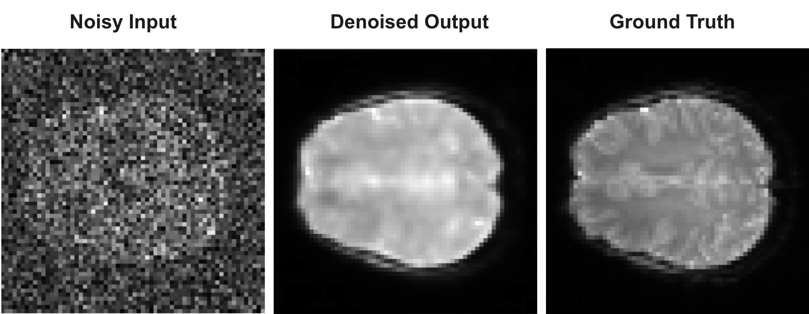

# Deep Learning for fMRI Denoising: A Comparative Analysis of 3D U-Net Attention and Wasserstein GAN Architectures for fMRI Denoising

This repository contains the official implementation for the medical imaging project "Deep Learning Based fMRI Denoising", comparing 3D U-Net Attention and 3DWGAN architectures. This study systematically develops and refines these models to enhance the signal-to-noise ratio (SNR) in functional Magnetic Resonance Imaging (fMRI) data.

---

## Table of Contents
- [Project Overview](#-project-overview)
- [Methodology and Architectures](#-methodology-and-architectures)
  - [Common Data Pipeline](#common-data-pipeline)
  - [Architecture 1: 3D U-Net with Attention (Iterative Development)](#architecture-1-3d-u-net-with-attention-iterative-development)
  - [Architecture 2: 3D Wasserstein GAN](#architecture-2-3d-wasserstein-gan)
- [Results Summary & Comparison](#-results-summary--comparison)
- [Qualitative Results](#-qualitative-results)
- [Repository Structure](#-repository-structure)
- [Setup and Usage](#-setup-and-usage)
- [Citation](#-citation)
- [License](#-license)

---

## Project Overview
Functional MRI (fMRI) data is inherently corrupted by significant noise, which compromises signal quality and limits neurobiological interpretations. This project tackles this challenge by implementing and comparing two state-of-the-art deep learning paradigms. The goal is to develop a robust model that can significantly reduce noise while preserving the fine-grained anatomical and structural details essential for accurate neuroscience research.

---

## Methodology and Architectures

### Common Data Pipeline

All experiments utilized the `ds002306` dataset from OpenNeuro. A key component of our methodology was a custom `tf.keras.utils.Sequence` data generator designed for **on-the-fly preprocessing**. This approach means that instead of preparing and saving all noisy-clean pairs to disk beforehand, the necessary transformations are applied dynamically **each time the model requests a new batch of data** during the training loop. This happens multiple times within every single epoch and is crucial for implementing strategies like variable noise and data augmentation effectively.

The foundational preprocessing steps applied to every 3D volume within this dynamic pipeline included:

- **Normalization:** Voxel intensities were scaled to a `[0, 1]` range to ensure a consistent data scale for the model. The clean, normalized volume serves as the ground truth target.
- **Noise Model:** Realistic Rician noise was synthetically added to the normalized, clean volumes to create the (Noisy Input, Clean Target) pairs required for the model to learn the denoising task.
### Architecture 1: 3D U-Net with Attention (Iterative Development)
Our primary investigation involved a 3D U-Net enhanced with CBAM (Convolutional Block Attention Module). The model's design evolved over three distinct attempts.

---
#### **Attempt 1: Baseline Model**
The goal was to establish a performance baseline using a state-of-the-art architecture on a small dataset.

- **Dataset:** **10 fMRI files**, totaling approximately **2,810** 3D volumes.
- **Architecture:** A 3D U-Net backbone with CBAM modules. The bottleneck uniquely featured a **Bidirectional LSTM** layer to model inter-slice dependencies.
- **Data Pipeline:**
    - **Noise Level:** **Constant** Rician noise (σ = 0.1).
    - **Augmentation:** None.
- **Loss Function:** `binary_crossentropy`.
- **Result:** Achieved a satisfactory PSNR of **34.54 dB** but produced over-smoothed images with significant detail loss.

---
#### **Attempt 2: Data Scaling & Fine-Tuning**
This attempt investigated if more data could improve the baseline model and if fine-tuning could recover lost details.

- **Dataset:** **20 fMRI files**, totaling approximately **5,620** 3D volumes.
- **Architecture:** Identical to Attempt 1 (3D Attn U-Net + **LSTM**).
- **Data Pipeline:** Identical to Attempt 1 (**Constant** noise, **No** augmentation).
- **Loss Function:**
    - *Phase A (Scaling):* `binary_crossentropy`.
    - *Phase B (Fine-Tuning):* A heavily SSIM-weighted `composite_loss` (α=0.8).
- **Result:**
    - *Phase A:* Performance **degraded** to **33.28 dB** PSNR, indicating the architecture could not generalize.
    - *Phase B:* All fine-tuning attempts **failed** due to severe overfitting.

---
#### **Attempt 3: Final Optimized Model**
This final iteration was a complete redesign based on the lessons learned from the previous failures.

- **Dataset:** **20 fMRI files** (approx. **5,620** volumes).
- **Architecture:** The **LSTM was removed** from the bottleneck and replaced with a more stable **Residual Block** to improve gradient flow. Skip connections were also enhanced with additional CBAM modules.
- **Data Pipeline (Robust):**
    - **Noise Level:** **Variable** Rician noise, with σ randomly sampled from a range of [0.05, 0.15] for each training sample.
    - **Augmentation:** **On-the-fly data augmentation** was enabled (random flips and intensity scaling).
- **Loss Function:** A **balanced composite loss** (`α=0.5`) combining Mean Absolute Error (MAE) for numerical accuracy and Structural Similarity Index (SSIM) for perceptual quality.
- **Result:** This holistic approach yielded the best performance of the project, with a PSNR of **37.62 dB** and an SSIM of **0.9223**.

---
### Architecture 2: 3D Wasserstein GAN
As an alternative approach, a generative model was implemented to learn the distribution of clean fMRI data directly, rather than performing direct pixel-wise reconstruction.

- **Architecture:**
    - **Generator:** A 3D encoder-decoder network with residual connections, designed to transform a noisy volume into a plausible clean volume.
    - **Discriminator (Critic):** A 3D CNN, stabilized with Spectral Normalization, trained to distinguish between real clean volumes and the generator's denoised outputs.
- **Training Objective:** The model was trained adversarially using the **Wasserstein distance** with a gradient penalty (`WGAN-GP`). This objective function provides a more stable training signal compared to standard GANs, encouraging the generator to produce outputs that are perceptually realistic. The training involved an asymmetric update schedule with 5 critic updates per generator update.
- **Challenges:** The training dynamics revealed the inherent instability of adversarial processes. While the model successfully learned to capture low-frequency brain structures, its quantitative performance was limited by patch-based training artifacts and the volatile nature of the generator-critic balance.

---

## Results Summary & Comparison

The iterative refinement of the 3D U-Net architecture proved highly effective. The final optimized model (Model 3) significantly outperformed all other approaches on quantitative metrics.

| Feature / Metric | Model 1 (Baseline U-Net) | Model 2 (Data-Scaled U-Net) | **Model 3 (Optimized U-Net)** | 3D WGAN (Optimized) |
| :--- | :---: | :---: | :---: | :---: |
| **Dataset Size** | ~2.8k vol | ~5.6k vol | **~5.6k vol** | ~5.6k vol |
| **Architecture** | Attn U-Net + LSTM | Attn U-Net + LSTM | **Attn U-Net + No LSTM** | GAN (Generator/Critic) |
| **Key Innovation**| Baseline | Data Scaling Test | **Robust Pipeline & Loss** | Adversarial Training |
| **Test PSNR (dB)** | 34.54 | 33.28 | **37.62 (Highest)** | 24.8 |
| **Test SSIM** | 0.865 | 0.796 | **0.9223 (Highest)** | 0.34 |

**Conclusion from Results:** While the 3DWGAN produced visually plausible results by learning the general structure of the brain, the optimized 3D U-Net (Model 3) provided far superior performance in terms of both numerical accuracy (PSNR) and structural similarity (SSIM). This suggests that for this specific denoising task, a well-engineered direct reconstruction model with a carefully chosen loss function is more effective than the generative approach.

---

## Qualitative Results

The final optimized U-Net model demonstrates a remarkable ability to restore anatomical structures from heavily corrupted inputs.

*(Note: Visual outputs for all models can be found in the `/result` directory.)*

---

## Repository Structure

The repository is organized to reflect the experimental process:
```
.
├── 3D_UNet_Attention_Architecture/
│   ├── model_1/
│   │   └── 3d-cnn-attention-lstm-model-1.ipynb
│   ├── model_2/
│   │   ├── 3d-cnn-attention-lstm-model-2-fine-tunning.ipynb
│   │   └── 3d-cnn-attention-lstm-model-2.ipynb
│   │   └── model_2.keras
│   └── model_3/
│       ├── dl-fmri-data-preparation.ipynb
│       └── 3d-unet-attention-model-3.ipynb
│
├── 3D_WGAN_Architecture/
│   └── 3d_wgan_slicing.ipynb
│   └── 3d_wgan_modelling.ipynb
│
├── result/
│   ├── 3d_unet_attention_model1_output.png
│   └── ... (and other result images)
│
├── .gitignore
├── LICENSE
├── requirements.txt
└── README.md
```

---

## Setup and Usage

### Prerequisites
A `requirements.txt` file is provided for easy setup. It is recommended to use a virtual environment.
```
tensorflow>=2.15.0
numpy
scipy
matplotlib
seaborn
ipywidgets
```

### Installation & Running
1.  **Clone the repository:**
    ```bash
    git clone https://github.com/gokhankarabag/Deep-Learning-for-fMRI-Denoising.git
    cd Deep-Learning-for-fMRI-Denoising
    ```
2.  **Install dependencies:**
    ```bash
    pip install -r requirements.txt
    ```
3.  **Download the Data:** The `ds002306` dataset used can be downloaded from [OpenNeuro](https://openneuro.org/datasets/ds002306). It is recommended to create a `data/` directory at the root of the project to store the files.
4.  **Run the Notebooks:** The Jupyter Notebooks (`.ipynb`) for each experiment are located in their respective architecture and model folders.

---

## 📄 Citation

If you find this work useful for your research, please consider citing our project report:
```bibtex
@project{THI2025FMRI,
  author  = {Gökhan Karabag and Mihir Joshi and Prajwal Shet and Aravind Gangavarapu and Shreyash Deokate},
  title   = {Deep Learning Based fMRI Denoising: 3D U-Net Attention, 3DWGAN},
  school  = {Technische Hochschule Ingolstadt},
  year    = {2025},
  month   = {June},
  note    = {Supervised by Prof. Dr. Marion Menzel \& Thomas Alan Loboy Ramos}
}
```

---

## ⚖️ License
This project is licensed under the MIT License.
